# SHORK 486 Gallery

* Updated 18th July 2026

## Photos

<table style="table-layout: fixed; width: 100%;">
  <tr>
    <td style="width: 33%; text-align: center;">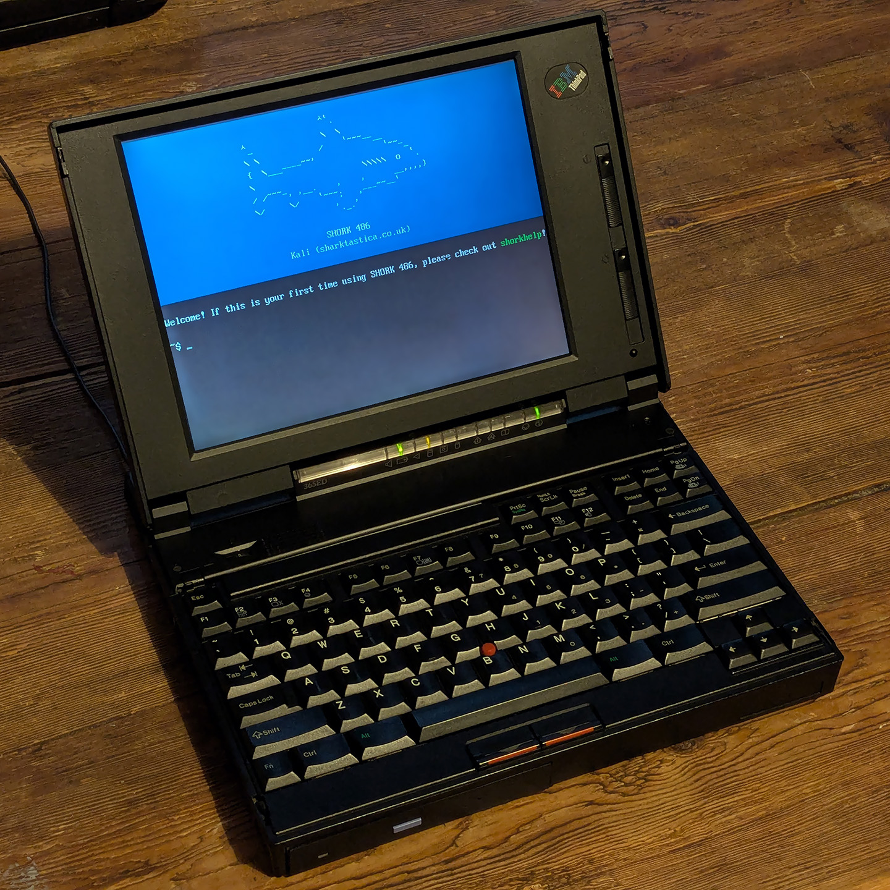</td>
    <td style="width: 33%; text-align: center;"></td>
  </tr>
  <tr>
    <td>First boot on IBM ThinkPad 365ED</td>
    <td>SHORKFETCH on IBM ThinkPad 365ED</td>
  </tr>
</table>

## Screenshots

<table style="table-layout: fixed; width: 100%;">
  <tr>
    <td style="width: 33%; text-align: center;">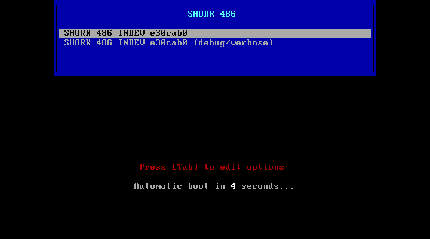</td>
    <td style="width: 33%; text-align: center;">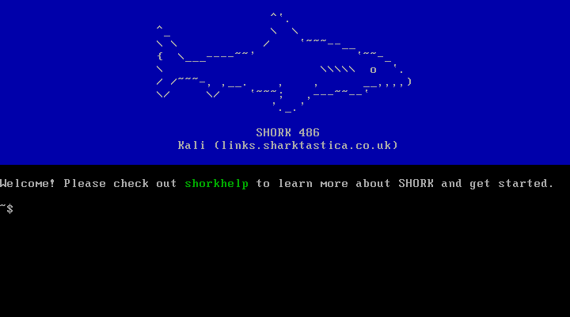</td>
  </tr>
  <tr>
    <td>Boot menu</td>
    <td>First boot</td>
  </tr>
</table>

<table style="table-layout: fixed; width: 100%;">
  <tr>
    <td style="width: 50%; text-align: center;"></td>
    <td style="width: 50%; text-align: center;"></td>
  </tr>
  <tr>
    <td>SHORKFETCH</td>
    <td>SHORKHELP</td>
  </tr>
</table>

<table style="table-layout: fixed; width: 100%;">
  <tr>
    <td style="width: 50%; text-align: center;"></td>
    <td style="width: 50%; text-align: center;"></td>
  </tr>
  <tr>
    <td>SHORKDIR (1)</td>
    <td>SHORKDIR (2)</td>
  </tr>
</table>

<table style="table-layout: fixed; width: 100%;">
  <tr>
    <td style="width: 50%; text-align: center;"></td>
    <td style="width: 50%; text-align: center;">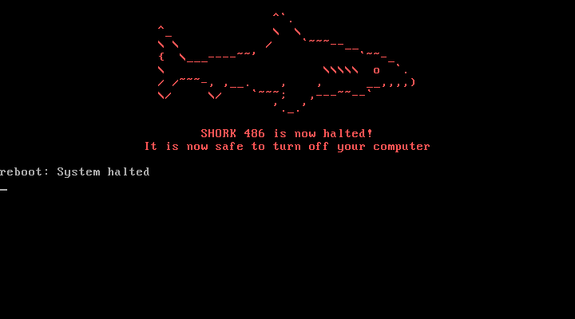</td>
  </tr>
  <tr>
    <td>SHORKSET</td>
    <td>SHORKOFF</td>
  </tr>
</table>

<table style="table-layout: fixed; width: 100%;">
  <tr>
    <td style="width: 50%; text-align: center;"></td>
    <td style="width: 50%; text-align: center;"></td>
  </tr>
  <tr>
    <td>SHORKLOCOMOTIVE</td>
    <td>SHORKMATRIX</td>
  </tr>
</table>

<table style="table-layout: fixed; width: 100%;">
  <tr>
    <td style="width: 50%; text-align: center;"></td>
    <td style="width: 50%; text-align: center;"></td>
  </tr>
  <tr>
    <td>SHORKMINES</td>
    <td>SHORKSAY</td>
  </tr>
</table>

<table style="table-layout: fixed; width: 100%;">
  <tr>
    <td style="width: 50%; text-align: center;">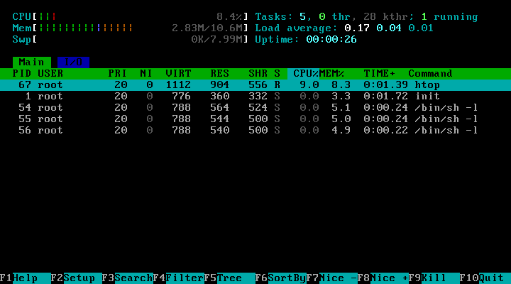</td>
    <td style="width: 50%; text-align: center;">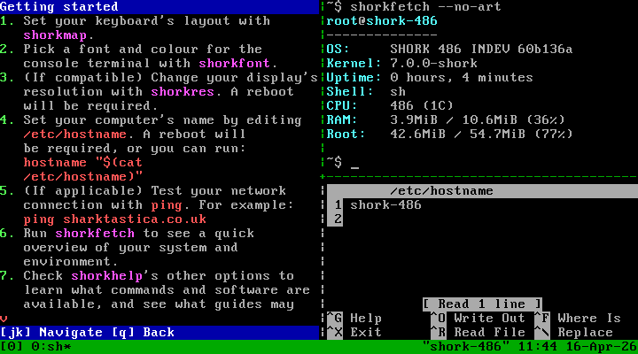</td>
  </tr>
  <tr>
    <td>htop</td>
    <td>tmux</td>
  </tr>
</table>

<table style="table-layout: fixed; width: 100%;">
  <tr>
    <td style="width: 50%; text-align: center;">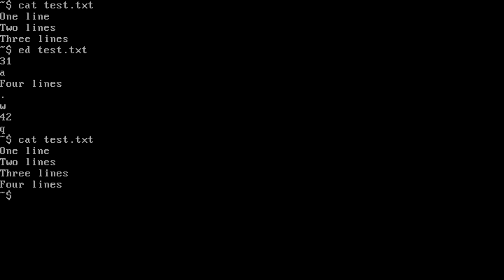</td>
    <td style="width: 50%; text-align: center;">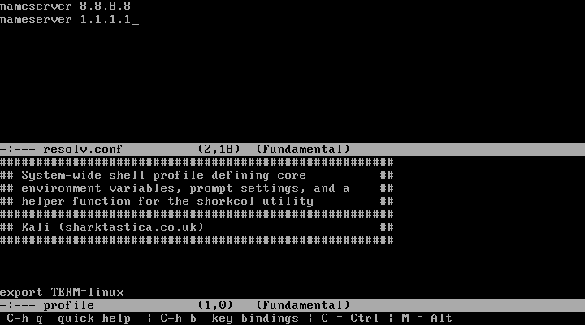</td>
  </tr>
  <tr>
    <td>ed</td>
    <td>Mg</td>
  </tr>
</table>

<table style="table-layout: fixed; width: 100%;">
  <tr>
    <td style="width: 50%; text-align: center;">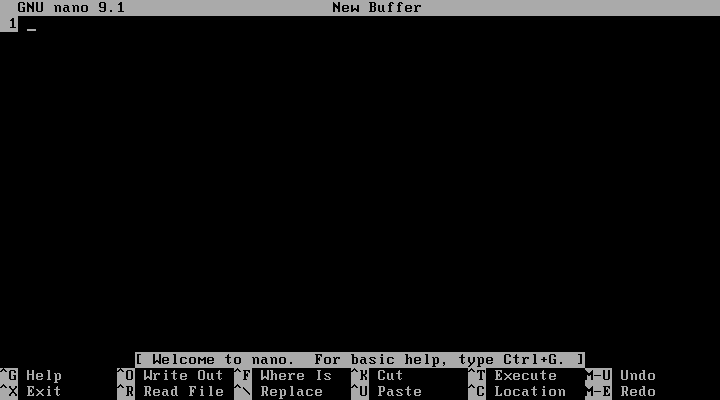</td>
    <td style="width: 50%; text-align: center;">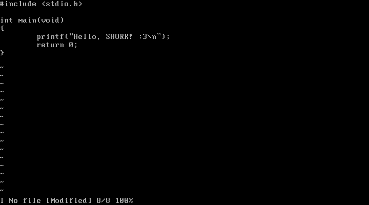</td>
  </tr>
  <tr>
    <td>nano</td>
    <td>vi</td>
  </tr>
</table>

<table style="table-layout: fixed; width: 100%;">
  <tr>
    <td style="width: 50%; text-align: center;">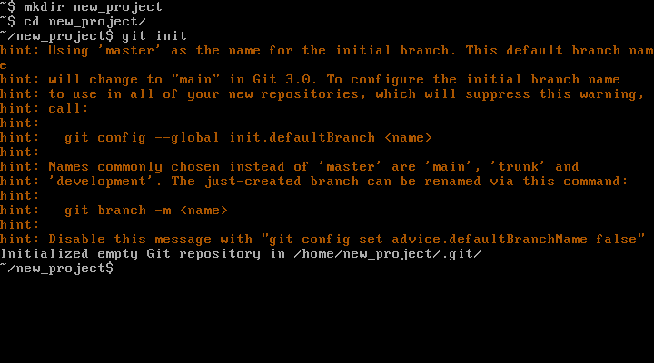</td>
    <td style="width: 50%; text-align: center;">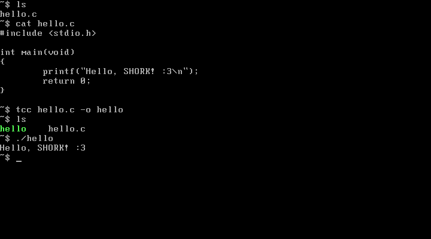</td>
  </tr>
  <tr>
    <td>git init</td>
    <td>Tiny C Compiler</td>
  </tr>
</table>

<table style="table-layout: fixed; width: 100%;">
  <tr>
    <td style="width: 100%; text-align: center;">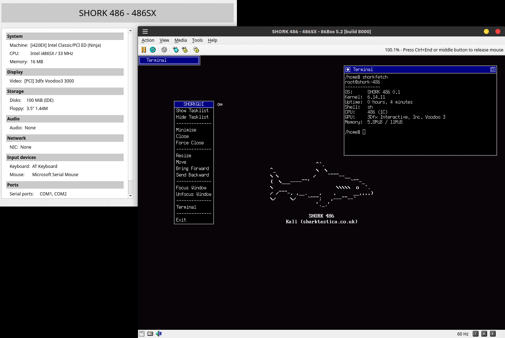</td>
  </tr>
  <tr>
    <td>SHORKGUI (experimental)</td>
  </tr>
</table>

<table style="table-layout: fixed; width: 100%;">
  <tr>
    <td style="width: 50%; text-align: center;">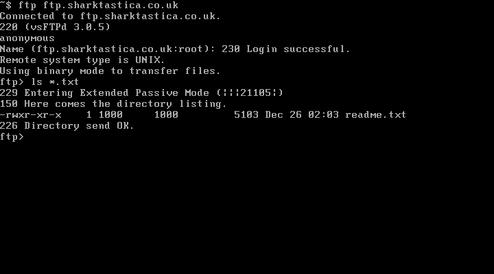</td>
    <td style="width: 50%; text-align: center;">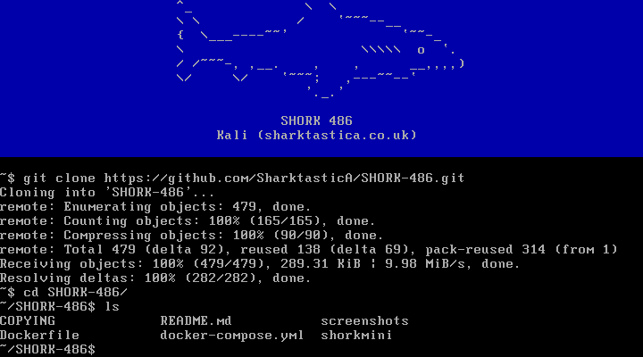</td>
  </tr>
  <tr>
    <td>FTP</td>
    <td>Git clone</td>
  </tr>
</table>
